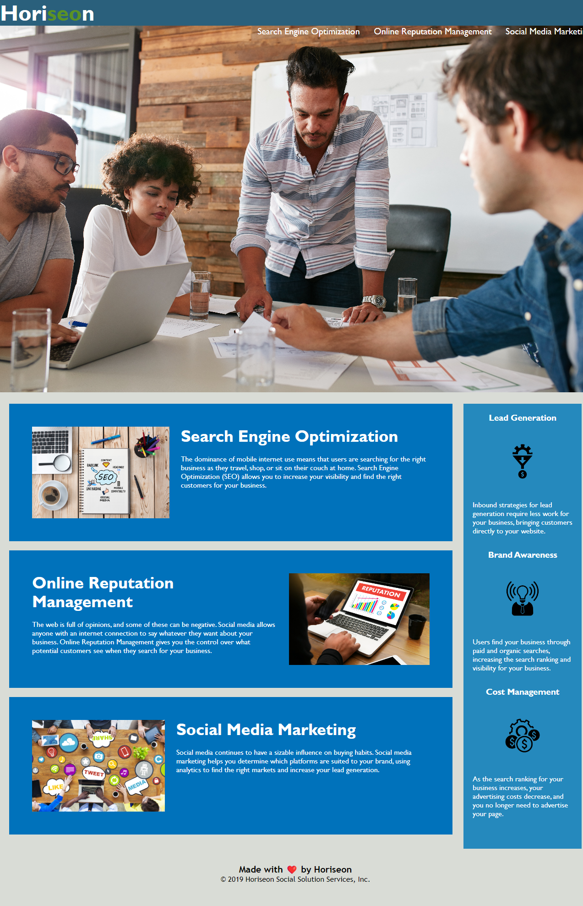

# Code-Refractor

UW Coding Bootcamp Week 1 Assignment
Submitted 3/23/23
Code updated by Jason Johnson
https://palmtopj.github.io/Code-Refractor/

This is a challenge to optimize starter code focusing on:
link functionality
CSS comments - color coding added using Better Comments extension
CSS semantics, structure, selectors

!! Need to move NAV items into header !!
